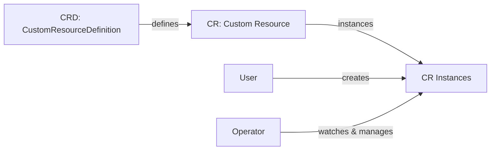
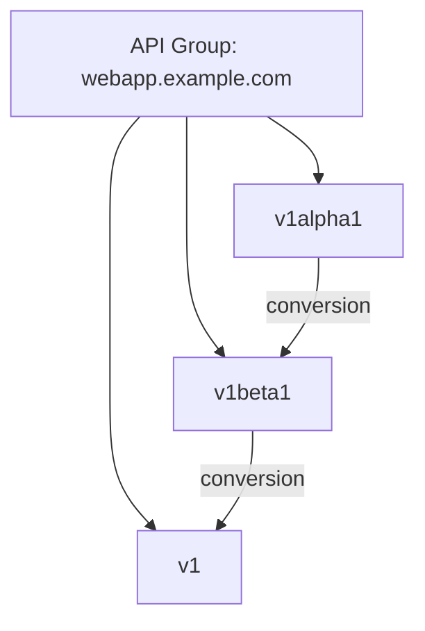
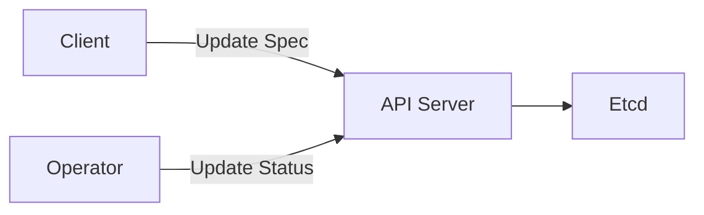

Custom Resource Definitions (CRDs) are the foundation of Kubernetes operators, allowing you to define your own domain-specific APIs. In this chapter, we'll explore how to design, create, and manage CRDs, showing both the Go code and the resulting Kubernetes YAML.

## What Are Custom Resources?

Custom Resources (CRs) extend the Kubernetes API, allowing you to define your own API objects. A Custom Resource Definition (CRD) defines the schema and validation rules for these custom resources.



## Defining a Custom Resource in Go

Let's look at a simple CRD for a web application in Go code:

```go
package v1alpha1

import (
    metav1 "k8s.io/apimachinery/pkg/apis/meta/v1"
)

// WebAppSpec defines the desired state of WebApp
type WebAppSpec struct {
    // Size is the number of replicas
    // +kubebuilder:validation:Minimum=1
    // +kubebuilder:validation:Maximum=10
    // +kubebuilder:default=1
    Size int32 `json:"size"`
    
    // Image is the container image to use
    // +kubebuilder:validation:Required
    Image string `json:"image"`
    
    // Port is the container port to expose
    // +kubebuilder:validation:Minimum=1
    // +kubebuilder:validation:Maximum=65535
    // +kubebuilder:default=8080
    Port int32 `json:"port,omitempty"`
}

// WebAppStatus defines the observed state of WebApp
type WebAppStatus struct {
    // Conditions represent the latest available observations
    // of the WebApp's state
    Conditions []metav1.Condition `json:"conditions,omitempty"`
    
    // AvailableReplicas is the number of ready replicas
    AvailableReplicas int32 `json:"availableReplicas"`
}

// +kubebuilder:object:root=true
// +kubebuilder:subresource:status
// +kubebuilder:printcolumn:name="Replicas",type="integer",JSONPath=".spec.size"
// +kubebuilder:printcolumn:name="Available",type="integer",JSONPath=".status.availableReplicas"
// +kubebuilder:printcolumn:name="Age",type="date",JSONPath=".metadata.creationTimestamp"

// WebApp is the Schema for the webapps API
type WebApp struct {
    metav1.TypeMeta   `json:",inline"`
    metav1.ObjectMeta `json:"metadata,omitempty"`

    Spec   WebAppSpec   `json:"spec,omitempty"`
    Status WebAppStatus `json:"status,omitempty"`
}

// +kubebuilder:object:root=true

// WebAppList contains a list of WebApp
type WebAppList struct {
    metav1.TypeMeta `json:",inline"`
    metav1.ListMeta `json:"metadata,omitempty"`
    Items           []WebApp `json:"items"`
}

func init() {
    SchemeBuilder.Register(&WebApp{}, &WebAppList{})
}
```

## Resulting CRD YAML

When you run `make manifests` with the above Go code, Kubebuilder generates a CRD YAML like this:

```yaml
apiVersion: apiextensions.k8s.io/v1
kind: CustomResourceDefinition
metadata:
  annotations:
    controller-gen.kubebuilder.io/version: v0.9.0
  name: webapps.webapp.example.com
spec:
  group: webapp.example.com
  names:
    kind: WebApp
    listKind: WebAppList
    plural: webapps
    singular: webapp
  scope: Namespaced
  versions:
  - additionalPrinterColumns:
    - jsonPath: .spec.size
      name: Replicas
      type: integer
    - jsonPath: .status.availableReplicas
      name: Available
      type: integer
    - jsonPath: .metadata.creationTimestamp
      name: Age
      type: date
    name: v1alpha1
    schema:
      openAPIV3Schema:
        description: WebApp is the Schema for the webapps API
        properties:
          apiVersion:
            description: 'APIVersion defines the versioned schema of this representation
              of an object. Servers should convert recognized schemas to the latest
              internal value, and may reject unrecognized values.'
            type: string
          kind:
            description: 'Kind is a string value representing the REST resource this
              object represents. Servers may infer this from the endpoint the client
              submits requests to. Cannot be updated.'
            type: string
          metadata:
            type: object
          spec:
            description: WebAppSpec defines the desired state of WebApp
            properties:
              image:
                description: Image is the container image to use
                type: string
              port:
                default: 8080
                description: Port is the container port to expose
                maximum: 65535
                minimum: 1
                type: integer
              size:
                default: 1
                description: Size is the number of replicas
                maximum: 10
                minimum: 1
                type: integer
            required:
            - image
            type: object
          status:
            description: WebAppStatus defines the observed state of WebApp
            properties:
              availableReplicas:
                description: AvailableReplicas is the number of ready replicas
                type: integer
              conditions:
                description: Conditions represent the latest available observations
                  of the WebApp's state
                items:
                  description: "Condition contains details for one aspect of the current
                    state of this API Resource."
                  properties:
                    lastTransitionTime:
                      description: lastTransitionTime is the last time the condition
                        transitioned from one status to another.
                      format: date-time
                      type: string
                    message:
                      description: message is a human readable message indicating
                        details about the transition.
                      type: string
                    reason:
                      description: reason contains a programmatic identifier indicating
                        the reason for the condition's last transition.
                      type: string
                    status:
                      description: status of the condition, one of True, False, Unknown.
                      type: string
                    type:
                      description: type of condition in CamelCase.
                      type: string
                  required:
                  - lastTransitionTime
                  - message
                  - reason
                  - status
                  - type
                  type: object
                type: array
            type: object
        type: object
    served: true
    storage: true
    subresources:
      status: {}
```

## Custom Resource Example

With the CRD registered in your cluster, a user can now create WebApp instances. Here's an example of a WebApp custom resource YAML:

```yaml
apiVersion: webapp.example.com/v1alpha1
kind: WebApp
metadata:
  name: example-webapp
  namespace: default
spec:
  size: 3
  image: nginx:1.19
  port: 80
```

When you run `kubectl get webapps`, the output would include the printer columns we defined:

```
NAME             REPLICAS   AVAILABLE   AGE
example-webapp   3          0           10s
```

After the operator processes this resource, it would update the status:

```yaml
apiVersion: webapp.example.com/v1alpha1
kind: WebApp
metadata:
  name: example-webapp
  namespace: default
spec:
  size: 3
  image: nginx:1.19
  port: 80
status:
  availableReplicas: 3
  conditions:
  - lastTransitionTime: "2023-04-15T14:23:01Z"
    message: "Deployment has minimum availability"
    reason: "MinimumReplicasAvailable"
    status: "True"
    type: "Available"
```

## Kubebuilder Markers Explained

Kubebuilder uses special comment markers to generate code and Kubernetes manifests. Let's examine their effects:

### Object Markers

```go
// +kubebuilder:object:root=true
```

This marker indicates that the type represents a top-level API object. It generates DeepCopy methods and registers the type with the scheme.

### Validation Markers

```go
// +kubebuilder:validation:Minimum=1
// +kubebuilder:validation:Maximum=10
// +kubebuilder:default=1
```

These markers generate OpenAPI validation in the CRD. In the YAML above, you can see they resulted in:

```yaml
size:
  default: 1
  maximum: 10
  minimum: 1
  type: integer
```

### Subresource Markers

```go
// +kubebuilder:subresource:status
```

This enables the status subresource, allowing status updates without modifying spec. In the CRD YAML:

```yaml
subresources:
  status: {}
```

### Additional Printer Columns

```go
// +kubebuilder:printcolumn:name="Replicas",type="integer",JSONPath=".spec.size"
```

This adds custom columns to the output of `kubectl get`. In the CRD YAML:

```yaml
additionalPrinterColumns:
- jsonPath: .spec.size
  name: Replicas
  type: integer
```

## CRD Versioning

As your API evolves, you'll need to create new versions. Here's how versioning works:



For example, if we create a new version `v1beta1` of our WebApp resource, we'd define it in a new package and implement conversion functions:

```go
// In api/v1beta1/webapp_types.go
type WebAppSpec struct {
    // Replicas is the number of instances (renamed from Size)
    Replicas int32 `json:"replicas"`
    
    // Container details
    Container struct {
        Image string `json:"image"`
        Port  int32  `json:"port,omitempty"`
    } `json:"container"`
}
```

The resulting CRD would include both versions:

```yaml
versions:
- name: v1alpha1
  # ... schema for v1alpha1
  served: true
  storage: false
- name: v1beta1
  # ... schema for v1beta1
  served: true
  storage: true
```

## Schema Validation in Action

Let's see how validation works in practice:

1. If a user tries to create a WebApp with 15 replicas (exceeds maximum):

```yaml
apiVersion: webapp.example.com/v1alpha1
kind: WebApp
metadata:
  name: invalid-webapp
spec:
  size: 15  # Exceeds maximum of 10
  image: nginx
```

They would get an error:

```
Error from server (spec.size: Invalid value: 15: spec.size in body should be less than or equal to 10)
```

2. If a user omits the required `image` field:

```yaml
apiVersion: webapp.example.com/v1alpha1
kind: WebApp
metadata:
  name: invalid-webapp
spec:
  size: 3
```

They would get an error:

```
Error from server (spec.image: Required value)
```

## Status Subresource

The status subresource allows separating state from intent:



In practice, clients update the spec while operators update the status:

```go
// Client updates spec
webapp.Spec.Size = 5
err = client.Update(ctx, webapp)

// Operator updates status
webapp.Status.AvailableReplicas = 5
err = client.Status().Update(ctx, webapp)
```

## Generating and Registering CRDs

Kubebuilder generates CRDs from your Go types:

```bash
# Generate CRDs
make manifests

# Apply CRDs to your cluster
make install
```

This creates YAML files in `config/crd/bases/` and applies them to your cluster.

## Best Practices for CRD Design

When designing your CRDs:

1. **Follow Kubernetes API conventions**
   - Use camelCase for JSON field names
   - Include status and spec sections

2. **Minimize the spec**
   - Include only what users should configure
   - Let the controller set sensible defaults

3. **Make status useful**
   - Report meaningful conditions
   - Include metrics relevant to users

4. **Design for versioning**
   - Start with alpha/beta versions
   - Plan for future changes

5. **Use validation**
   - Enforce constraints early
   - Provide helpful validation messages

## Conclusion

Custom Resource Definitions allow you to extend Kubernetes with your own domain-specific APIs. By defining Go structs with appropriate Kubebuilder markers, you can generate CRDs that integrate seamlessly with the Kubernetes ecosystem.

In the next chapter, we'll build a simple operator that uses the CRD we've defined to manage web applications.