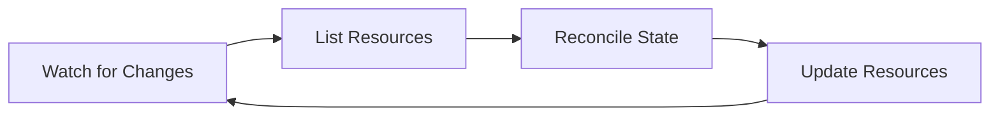
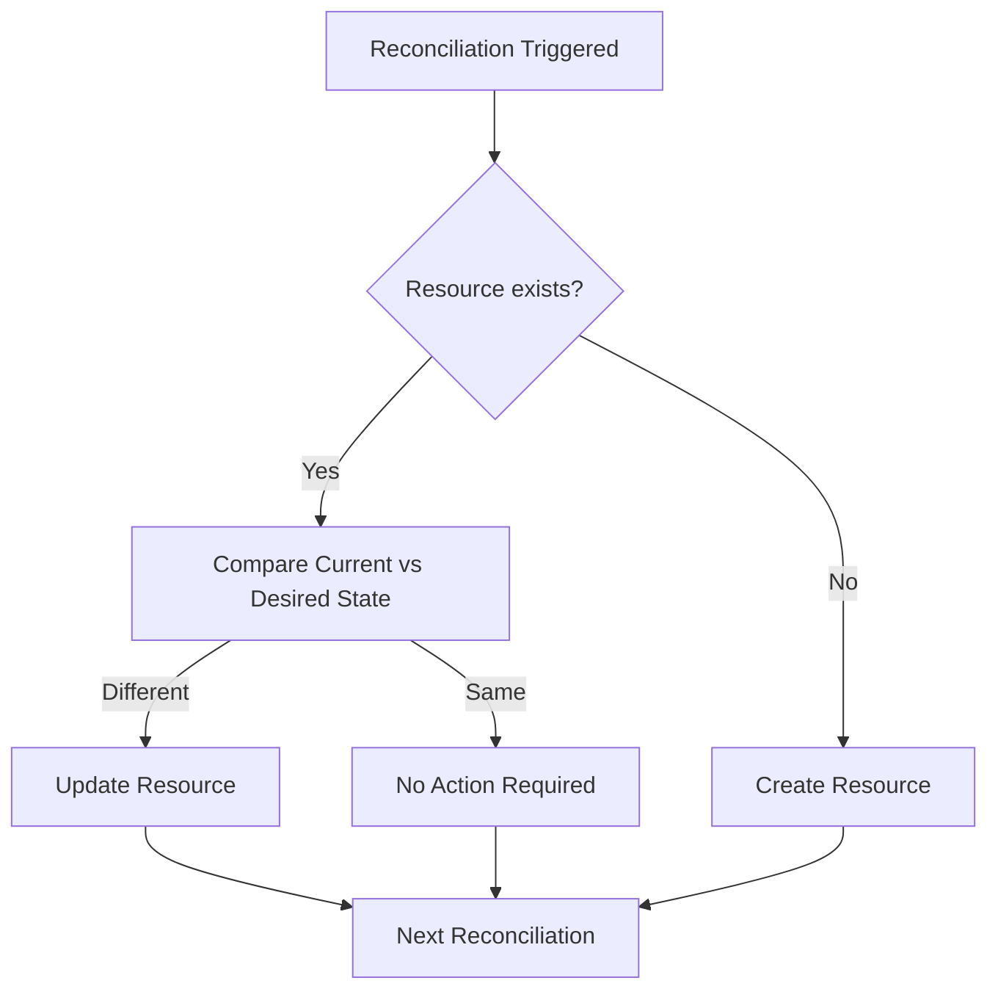
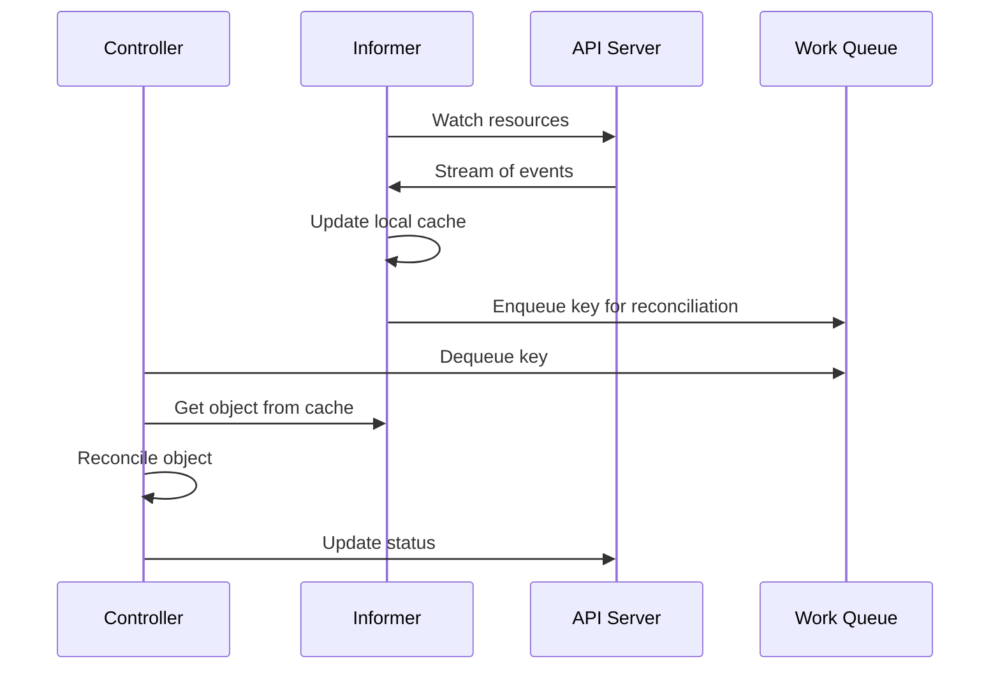
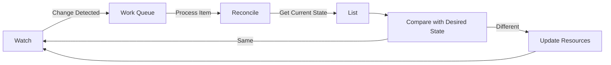
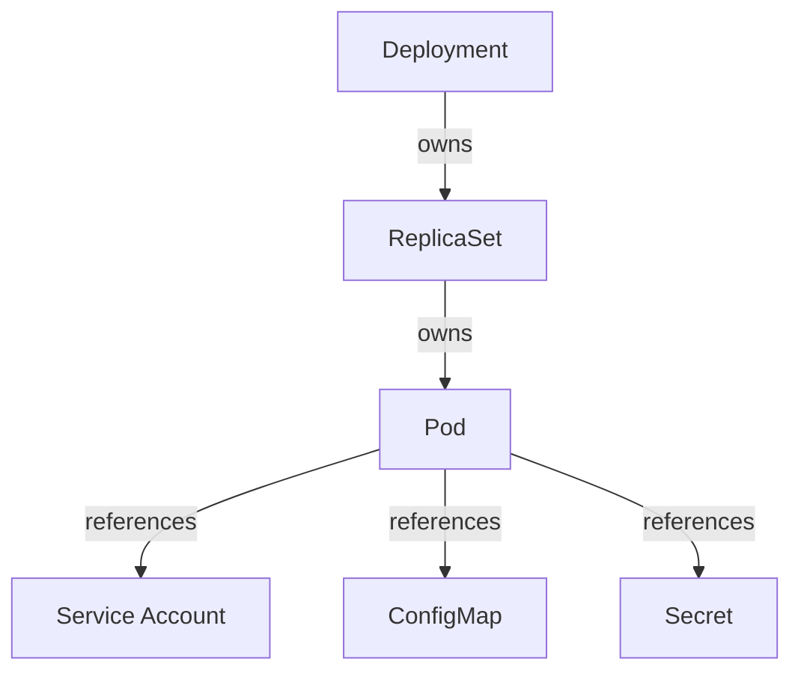
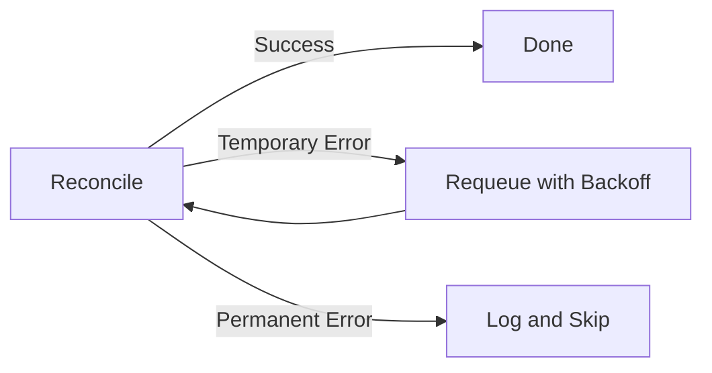

Controllers are the foundation of how Kubernetes maintains system state. Understanding how controllers work is essential to building effective operators. This chapter explains the controller pattern and introduces the reconciliation process.

## The Control Loop Pattern

At its core, a Kubernetes controller implements a "control loop" pattern. This pattern constantly watches for changes to resources and takes action to ensure the actual state of the cluster matches the desired state.



This pattern is often summarized as:

1. **Observe**: Watch for changes to resources
2. **Analyze**: Compare current state with desired state
3. **Act**: Take actions to align current with desired state

## The Reconciliation Process

Reconciliation is the heart of a controller. It's the process of comparing the actual state of a resource with its desired state and making the necessary changes to align them.



Key aspects of reconciliation:

- **Idempotent**: Running the reconciler multiple times should not cause problems
- **Eventual Consistency**: The system may take time to reach the desired state
- **Level-Triggered**: The controller focuses on the current state, not individual events

## Events and Informers

Controllers use the Kubernetes API server to watch for changes. The mechanism for this is called an "informer."



The informer:
- Maintains a local cache of resources
- Watches for changes
- Filters events
- Triggers reconciliation by adding items to a work queue

## The Watch-List-Reconcile Pattern

The controller pattern implements three main operations:

1. **Watch**: Observe changes to resources
2. **List**: Retrieve the current state of resources
3. **Reconcile**: Align actual state with desired state



## Resources and Resource Ownership

Controllers often manage multiple related resources. For example, a Deployment controller manages ReplicaSets, which in turn manage Pods.

To track these relationships, Kubernetes uses **owner references**:



Owner references:
- Establish parent-child relationships between resources
- Enable garbage collection when parent resources are deleted
- Prevent orphaned child resources

## Error Handling and Requeuing

Controllers must handle errors gracefully. When a reconciliation fails:

1. Log the error
2. Requeue the item for later processing
3. Apply exponential backoff for retries



## Controller Runtime in Go

In Go, we typically use controller-runtime library to implement controllers. This provides:

- Reconciler interface
- Manager to coordinate controllers and shared resources
- Source and EventHandler to configure watches
- Predicate to filter events
- Client to interact with the Kubernetes API

```go
// Sample reconciler interface from controller-runtime
type Reconciler interface {
    Reconcile(context.Context, Request) (Result, error)
}
```

## Conclusion

Understanding the controller pattern is fundamental to building Kubernetes operators. The reconciliation loop, informers, and ownership patterns form the foundation for extending Kubernetes with custom operational logic.

In the next chapter, we'll set up our development environment and start building a simple operator using the concepts we've learned.