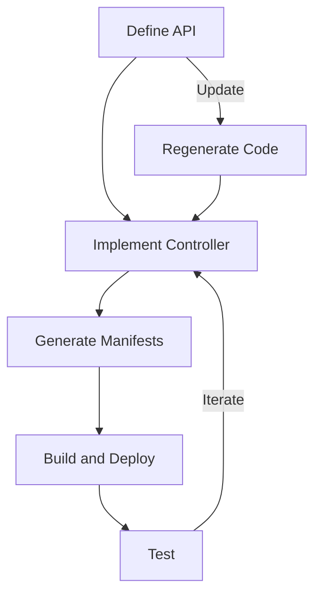

Before we can build a Kubernetes operator, we need to set up a proper development environment. This chapter covers the tools you'll need and how to bootstrap a new operator project.

## Required Tools

To develop Kubernetes operators, you'll need the following tools:

1. **Go**: The language we'll use to build our operator (version 1.18+)
2. **kubectl**: The Kubernetes command-line tool
3. **A Kubernetes cluster**: For development and testing
4. **kubebuilder**: A framework for building Kubernetes APIs and controllers
5. **kustomize**: A tool for customizing Kubernetes manifests
6. **Docker**: For building container images

Let's install these tools:

```bash
# Install Go (if not already installed)
# Visit https://golang.org/dl/ for the latest version

# Install kubectl
curl -LO "https://dl.k8s.io/release/$(curl -L -s https://dl.k8s.io/release/stable.txt)/bin/linux/amd64/kubectl"
chmod +x kubectl
sudo mv kubectl /usr/local/bin/

# Install kind (for a local Kubernetes cluster)
GO111MODULE="on" go get sigs.k8s.io/kind@v0.11.1

# Install kubebuilder
curl -L -o kubebuilder https://go.kubebuilder.io/dl/latest/$(go env GOOS)/$(go env GOARCH)
chmod +x kubebuilder
sudo mv kubebuilder /usr/local/bin/

# Install kustomize
curl -s "https://raw.githubusercontent.com/kubernetes-sigs/kustomize/master/hack/install_kustomize.sh" | bash
sudo mv kustomize /usr/local/bin/
```

## Setting Up a Local Kubernetes Cluster

For development, we'll use `kind` (Kubernetes IN Docker) to create a local cluster:

```bash
# Create a kind cluster
kind create cluster --name operator-dev

# Verify the cluster is running
kubectl cluster-info --context kind-operator-dev
```

## Bootstrapping an Operator Project

Now let's create a new operator project using Kubebuilder:

```bash
# Create a new directory for your project
mkdir sample-operator
cd sample-operator

# Initialize a new module
go mod init github.com/example/sample-operator

# Initialize Kubebuilder project
kubebuilder init --domain example.com --repo github.com/example/sample-operator

# Create an API and controller
kubebuilder create api --group apps --version v1alpha1 --kind SampleApp
```

## Project Structure

After bootstrapping, your project will have the following structure:

```
sample-operator/
├── Dockerfile            # For building the operator image
├── Makefile              # Common development tasks
├── PROJECT               # Kubebuilder project configuration
├── api/                  # API definitions (CRDs)
│   └── v1alpha1/         # API version
│       ├── groupversion_info.go
│       ├── sampleapp_types.go
│       └── zz_generated.deepcopy.go
├── bin/                  # Compiled binaries
├── config/               # Kubernetes manifests
│   ├── crd/              # CRD manifests
│   ├── default/          # Default configurations
│   ├── manager/          # Manager configurations
│   ├── rbac/             # RBAC configurations
│   └── samples/          # Sample CR manifests
├── controllers/          # Controller implementations
│   ├── sampleapp_controller.go
│   └── suite_test.go
├── go.mod
├── go.sum
├── hack/                 # Scripts and tools
└── main.go               # Main entry point
```

Let's look at key files:

### main.go

This is the entry point of your operator:

```go
// main.go
package main

import (
    // Imports...
)

func main() {
    // Setup logger
    // Parse flags
    // Create a manager
    // Register controllers
    // Start the manager
}
```

### API Definition (CRD)

The API definition for your custom resources:

```go
// api/v1alpha1/sampleapp_types.go
package v1alpha1

// SampleAppSpec defines the desired state of SampleApp
type SampleAppSpec struct {
    // Define your desired state fields here
    Replicas int32  `json:"replicas,omitempty"`
    Image    string `json:"image"`
}

// SampleAppStatus defines the observed state of SampleApp
type SampleAppStatus struct {
    // Define your observed state fields here
    AvailableReplicas int32 `json:"availableReplicas"`
}

// SampleApp is the Schema for the sampleapps API
type SampleApp struct {
    metav1.TypeMeta   `json:",inline"`
    metav1.ObjectMeta `json:"metadata,omitempty"`

    Spec   SampleAppSpec   `json:"spec,omitempty"`
    Status SampleAppStatus `json:"status,omitempty"`
}
```

### Controller

The controller implementation:

```go
// controllers/sampleapp_controller.go
package controllers

// SampleAppReconciler reconciles a SampleApp object
type SampleAppReconciler struct {
    client.Client
    Log    logr.Logger
    Scheme *runtime.Scheme
}

// Reconcile is the main reconciliation loop
func (r *SampleAppReconciler) Reconcile(ctx context.Context, req ctrl.Request) (ctrl.Result, error) {
    // Implement reconciliation logic here
}

// SetupWithManager sets up the controller with the Manager
func (r *SampleAppReconciler) SetupWithManager(mgr ctrl.Manager) error {
    return ctrl.NewControllerManagedBy(mgr).
        For(&appsv1alpha1.SampleApp{}).
        Owns(&appsv1.Deployment{}).
        Complete(r)
}
```

## Kubebuilder Markers

Kubebuilder uses special comments called "markers" to generate code, Kubernetes manifests, and documentation:

```go
// +kubebuilder:resource:shortName=app
// +kubebuilder:subresource:status
// +kubebuilder:printcolumn:name="Replicas",type=integer,JSONPath=`.spec.replicas`
// +kubebuilder:printcolumn:name="Available",type=integer,JSONPath=`.status.availableReplicas`
// +kubebuilder:printcolumn:name="Age",type=date,JSONPath=`.metadata.creationTimestamp`
```

## Development Workflow

The typical development workflow:



1. **Define your API**: Update the types in the api/ directory
2. **Generate code**: `make generate`
3. **Generate CRDs**: `make manifests`
4. **Implement controller logic**: Update the reconcile function
5. **Run the controller**: `make run`
6. **Build and deploy**: `make docker-build docker-push` then `make deploy`

## Common Make Commands

The generated Makefile includes several useful commands:

```bash
# Generate code
make generate

# Generate CRD manifests
make manifests

# Run the controller locally
make run

# Build and push the Docker image
make docker-build docker-push

# Deploy the controller to the cluster
make deploy

# Uninstall the controller
make uninstall

# Run tests
make test
```

## Conclusion

You now have a development environment set up to build Kubernetes operators. We've bootstrapped a project using Kubebuilder, and you understand the basic project structure and workflow.

In the next chapter, we'll dive deeper into Custom Resource Definitions (CRDs) and learn how to define your API effectively.