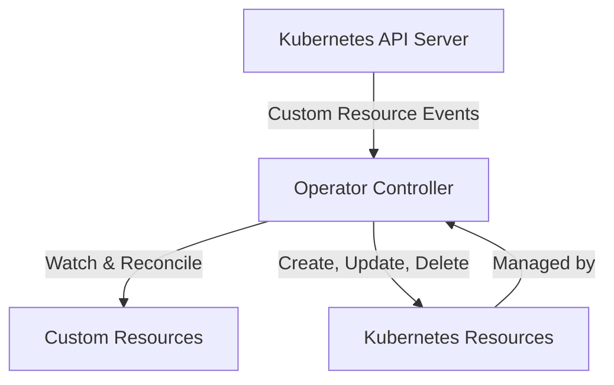
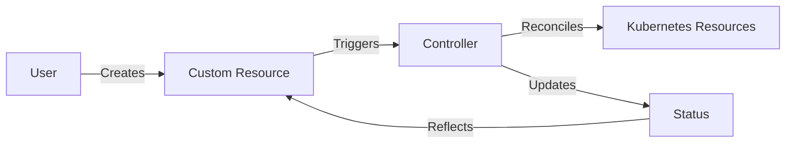

Kubernetes operators allow you to extend Kubernetes' functionality by automating complex application operations. In this chapter, we'll explore what operators are, why they're useful, and how they work.

## What Are Kubernetes Operators?

Kubernetes operators are software extensions to Kubernetes that make use of custom resources to manage applications and their components. An operator is essentially a custom controller that watches for specific events and takes action to align the actual state of your cluster with your desired state.

## Why Use Operators?

Operators help you automate tasks that would otherwise require manual intervention, especially for stateful applications. They encode operational knowledge that would traditionally require a human operator.

Key benefits include:

- **Automating complex operations**: Database provisioning, scaling, backups, and failovers
- **Application lifecycle management**: Installation, updates, and graceful termination
- **Self-healing**: Automatic recovery from failures
- **Consistent management**: Standardized way to deploy and manage complex applications

## Controllers vs. Operators

All operators are controllers, but not all controllers are operators:

| Controller | Operator |
|------------|----------|
| Manages built-in Kubernetes resources | Manages custom resources |
| Part of Kubernetes core | Extension to Kubernetes |
| Focuses on state reconciliation | Encodes domain-specific knowledge |

## The Operator Pattern

The operator pattern consists of these core components:

1. **Custom Resource Definition (CRD)**: Extends the Kubernetes API
2. **Custom Resource (CR)**: An instance of a CRD
3. **Controller**: Watches for changes and reconciles state
4. **Domain-specific logic**: The "operational knowledge" encoded in the controller

## Real-World Operator Examples

Operators are widely used in production environments:

- **Prometheus Operator**: Manages monitoring stacks
- **Elasticsearch Operator**: Handles Elasticsearch clusters
- **etcd Operator**: Manages etcd clusters
- **PostgreSQL Operator**: Automates PostgreSQL database management
- **Redis Operator**: Manages Redis clusters

## Operator Maturity Levels

Operators can range from basic to sophisticated based on their capabilities:

1. **Basic Installation**: Automated application deployment
2. **Seamless Upgrades**: Version upgrades with minimal downtime
3. **Full Lifecycle Management**: Backups, restores, scaling
4. **Deep Insights**: Metrics, alerts, and logging
5. **Auto-pilot**: Automated tuning and self-healing

## When to Use (or Not Use) Operators

Operators are ideal for:
- Stateful applications with complex operational requirements
- Applications requiring specialized knowledge to operate
- Systems needing automated day-2 operations

Operators might be overkill for:
- Simple stateless applications
- Applications already well-managed by Deployments or StatefulSets
- Situations where complexity outweighs benefits

## Conclusion

Kubernetes operators provide a powerful way to extend Kubernetes' capabilities by encoding operational knowledge into software. In the next chapter, we'll dive deeper into the controller pattern that underpins operators and explore how the reconciliation process works.